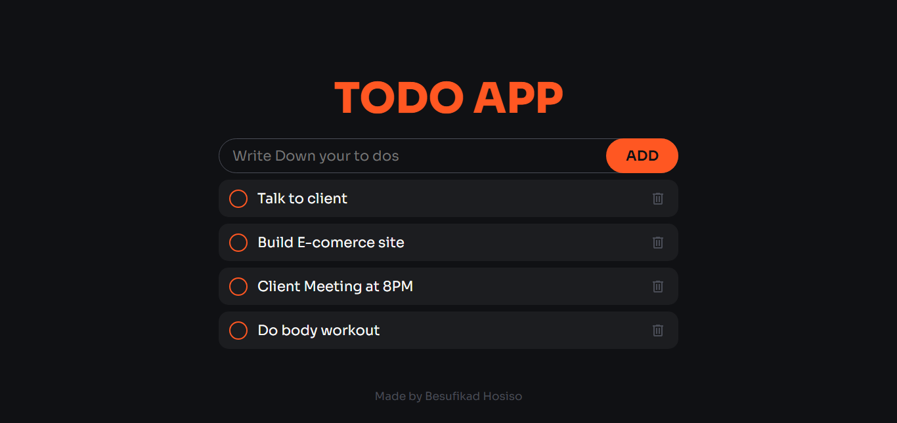
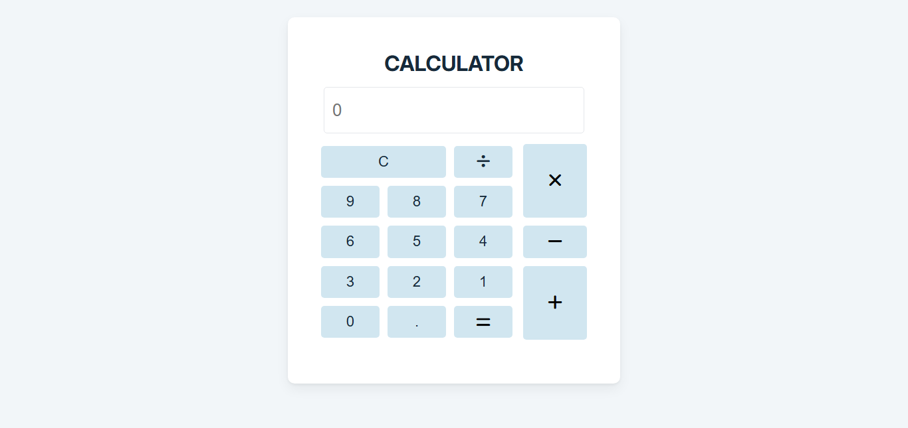

# Hi there, I'm BESUFIKAD HOSISO! 👋

## About Me 🚀

I'm a passionate **Frontend Developer** with experience in **HTML, CSS, JavaScript, Tailwind, Bootstrap and React**. I love tackling complex problems, learning new skills, and collaborating with diverse teams to create innovative solutions.

- 🌱 Currently learning: **Node.js, MongoDb and Python**
- 🔭 Working on: **building my own online agency while continuing to develop projects and expand my skills in web development.**
- 🌍 Languages: **Programming languages: HTML, CSS, JavaScript, Python (beginner), SQL (basic); Human languages: English (fluent), Amharic (native), French (basic).**
- 📫 How to reach me: **besuyeboss@gmail.com**
- ⚡ Fun fact: **Debugging code is my version of a puzzle game.**

## My Skills 🧠

## Featured Projects 💻

### TODO APP Project

**TODO APP Project** is a **simple mobile app that helps users manage everyday tasks.** I built it with **with HTML, CSS, and JavaScript.**. This project demonstrates my ability to **design clean interfaces, write organized code, and build functional features from scratch.**. You can check out the repository [here](https://besuhosiso.github.io/TODO-APP/).

### Calculator Project

**Calculator Project** is a **basic calculator that handles common arithmetic operations.** I built with **HTML, CSS, and JavaScript.**. This project showcases my skills in **DOM manipulation, layout design, and building interactive UI components.**. You can check out the repository [here](https://besuhosiso.github.io/Calcula/).

## Get in Touch 📬

- **[Portfolio Website](https://besuhosiso.github.io/besuthedev/)**
- **[LinkedIn](https://www.linkedin.com/in/besufikad-hosiso-23a2313aa/)**
- **[Twitter]**(your_twitter_profile_link)

